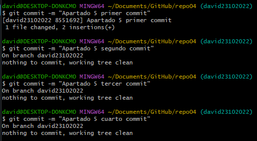
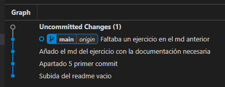

# Git & Markdown

## Ejercicio 4

***

### **4.1**

Para el primer apartado hemos creado el directorio en GitHub y lo hemos clonado en local ya que me parecía la manera más optima.

### **4.2**

Para subir el archivo "readme.md" al directorio remoto, seguimos los pasos que hemos visto en ejercicios anteriores, añadimos el archivo al stagin area, realizamos el commit y posteriormente el push para subir el archivo al remoto.

### **4.3**

Para crear una nueva rama usamos el comando "git branch (nombre de la rama)" y posteriormente "git checkout (nombre de la rama)" para acceder a ella.

### **4.4**

Desde la rama que acabamos de crear abrimos el editor de texto en el fichero "readme.md" con el siguiente comando:

Se abrirá el editor, introducimos el texto solicitado, para guardar pulsamos la tecla de escape y posteriormente introducimos ":w", si por lo contrario queremos salir del editor pulsamos nuevamente escape e introducimos ":q".

### **4.5**

Realizamos los cuatro commits solicitados pese a que apartir del primero no realiza ninguna acción al no detectar cambios.

### **4.6**

#### **4.6.1**

Volvemos a la rama principal con "git checkout (nombre rama)" y fusionamos la rama anteriormente creada con esta mediante "git merge (nombre rama)".

#### **4.6.2**

Realizamos el push para subir al remoto los cambios que hemos hecho al fichero desde la rama que habíamos creado.

Si utilizamos "git log" podemos ver que solo refleja el commit que hemos realizado con el "readme.md" vacío al inicio, y el primero de los 4 commit que hemos realizado para el quinto apartado

### **4.7**

Eliminamos la rama en local mediante el comando "git branch -d (nombre de la rama)".

### **4.8**

Desde el "git log" se visualiza de la siguiente manera:

Desde el plugin de VSC se visualiza de la siguiente manera:

